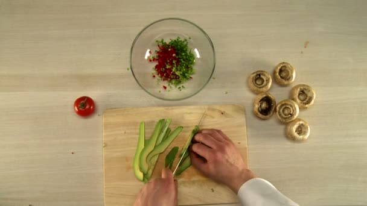

<div align="center">

# 🍅 One Sheet:  The Royal Tomato

```
One Sheet / Uma Página 
```
#### Termos que se referem à um documento simples (de uma página) com o objetivo de guardar a ideia de um jogo.

```
Documento de Uma Página
```

```
 Documento de Página Única
```


#### 📋 Nesse documento deve conter: 

✔️ Nome do jogo;<br>
✔️ Público Alvo;<br>
✔️ Resumo do Jogo;<br>
```
 Pilares:
```
✔️ Personagem, <br>
✔️ Câmera, <br>
✔️ Controles e Ações

```

```

✔️ Esboço do Jogo;<br>
✔️ Pontos Fortes;<br>
✔️ Jogos Similares.<br><br><br>
## 🎭 Gênero
Simulação [cooking sim + farming sim]

## 🏗️ Plataforma
Navegadores, dispositivos móveis e computadores.

## 📜 História

Você joga como um conzinheiro de um castelo medieval que tem o sonho de preparar uma refeição para o rei. Porém, seu valor ainda deve ser provado. Todos os dias você deve cozinhar para alguém do castelo para aumentar sua reputação, até chegar o dia tão esperado.

## 🎮 Gameplay

Separado em duas mecânicas: o preparo da refeição e o cultivo da colheita. <br><br>
☀️ Durante o dia você cuida da sua fazendinha, planta sementes e colhe seus frutos. <br>
🌑 Durante a noite, você vai para o castelo preparar uma refeição.

O preparo da refeição envolve: cortar, fatia e picar os ingredientes de sua salada, e você ganha mais pontos por fazer isso bem.

## 🎯 Publico Alvo

Jogares casuais que gostam de jogos de simulação e fantasia.

## 📸 Câmera

Primeira pessoa, fixa, estática.

## 🕹️ Controles e Ações

Todas as ações são realizadas com o mouse, como por exemplo: 

🔪 Picar ou fatiar ingredientes;<br> Colocá-los no prato;<br>
🚜 Colher frutos da horta;<br>
🌱 Plantar sementes.

Transferir frutos da geladeira para a mochila, com espaço limitado.

## 📂 Moodboard / Galeria

 <br>


<br><br>Feito com 💜 por Karina.<br><br><br>
</div>